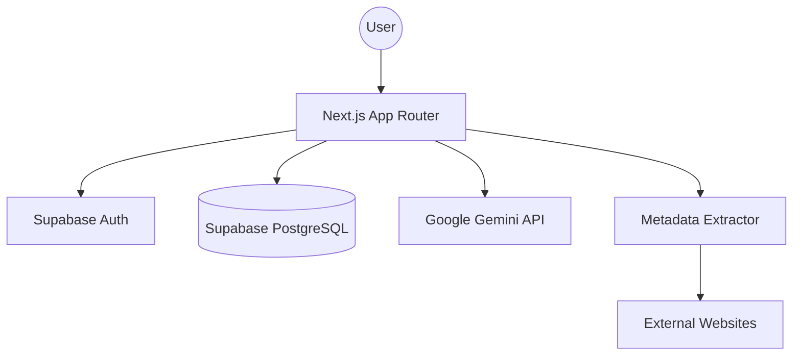

# Read Later App 📚

A modern, full-stack "Read Later" web application that helps you organize your bookmarks with AI-powered summaries.


## Features

-   **Seamless Authentication**: Secure login with Google via Supabase Auth.
-   **One-Click Saving**: Browser bookmarklet for saving links instantly from any website.
-   **Gemini Native Video Understanding**: Direct YouTube URL processing using Gemini's native multimodal capabilities (`fileUri`).
-   **Advanced Article Extraction**: Uses `@mozilla/readability` to isolate main content, stripping away noise.
-   **Markdown Summary Rendering**: AI-generated summaries are beautifully formatted with headers, lists, and bold text.
-   **Clean, Focus-Oriented UI**: A professional image-free list view with hover-activated archive/delete actions.
-   **Lazy Loading**: Links are saved instantly; summaries are generated in the background.
-   **Rich Metadata**: Displays Site Name, Domain, and Reading Time/Video tags for every link.
-   **State Management**: Easily organize your reading list into "To Read" and "Archive".
-   **Full Dark Mode Support**: Toggle between Light, Dark, and System themes with a beautiful, high-contrast UI.

## Technical Architecture

### High-Level Design

The application follows a modern full-stack architecture using Next.js for the frontend and API layer, with Supabase providing the backend infrastructure.



### Tech Stack & Rationale

| Technology | Role | Rationale |
| :--- | :--- | :--- |
| **Next.js 15+** | Web Framework | Utilizes App Router for SSR/Streaming and efficient API routes. |
| **Supabase** | Backend-as-a-Service | Provides PostgreSQL with real-time capabilities and simplified Auth integration. |
| **Google Gemini 2.5 Flash** | AI Engine | High-performance multimodal model, specifically chosen for its native video processing. |
| **Tailwind CSS 4** | Styling | Modern utility-first CSS for a rapid and consistent design system. |
| **Vitest** | Testing | Fast, modern test runner with high compatibility for the Next.js ecosystem. |

### Data Flow & Lifecycle

1.  **Link Submission**: User submits a URL via the UI or Bookmarklet.
2.  **Metadata Extraction**: The server fetches the URL, extracts title, site name, and main content using `@mozilla/readability`.
3.  **Persistence**: Initial link record is saved to Supabase PostgreSQL with `status: 'unread'`.
4.  **Background Summarization**:
    -   Client triggers a summarization request.
    -   The server sends the extracted content (or video URL for YouTube) to Gemini.
    -   Gemini generates a Markdown summary.
    -   The summary is saved back to the database.
5.  **State Management**: Users can archive or delete links, updating the `status` or removing the record via RLS-protected queries.

### Component Breakdown

-   **Layouts**: Standardized navigation and theme wrapping.
-   **Server Components**: Efficiently fetch initial link lists directly from Supabase.
-   **Client Components**:
    -   `LinkListClient`: Manages real-time updates and filtering.
    -   `LinkCard`: Handles interactive states (summarize, archive, delete).
    -   `AddLinkForm`: Unified input for adding new content.
-   **Library Modules**: Decoupled logic for API utilities, metadata extraction, and AI processing.

### Key Architectural Decisions

-   **Strict Environment Validation**: Uses `zod` to validate all server and client environment variables at runtime, preventing "missing key" bugs in production.
-   **Multimodal AI Processing**: For YouTube videos, instead of just summarizing text transcripts, the app leverages Gemini's `fileUri` capability for deeper video understanding.
-   **Row Level Security (RLS)**: Enforces data isolation directly at the database level, ensuring users can only ever access their own links.

## Getting Started

### 1. Prerequisites

-   A Supabase account.
-   A Google AI API Key (Gemini).

### 2. Environment Variables

Create a `.env.local` file in the root directory:

```env
NEXT_PUBLIC_SUPABASE_URL=your_supabase_url
NEXT_PUBLIC_SUPABASE_ANON_KEY=your_supabase_anon_key
GOOGLE_AI_API_KEY=your_gemini_api_key
```

### 3. Database Setup

Run the SQL provided in `schema.sql` (or refer to the snippet below) in your Supabase SQL Editor.

```sql
-- Links Table with RLS
create table links (
  id uuid default gen_random_uuid() primary key,
  user_id uuid references auth.users not null,
  url text not null,
  title text,
  description text,
  site_name text,
  type text,
  summary text,
  reading_time integer,
  status text check (status in ('unread', 'archived')) default 'unread',
  created_at timestamp with time zone default now()
);

alter table links enable row level security;

create policy "Users can manage their own links"
  on links for all using (auth.uid() = user_id);
```

### 4. Supabase Auth Configuration

1.  Enable **Google** as an Auth Provider in Supabase.
2.  Add your app URL (Local & Production) to the **Redirect URLs**:
    -   `http://localhost:3000/auth/callback`
    -   `https://your-app.vercel.app/auth/callback`

### 5. Installation & Development

```bash
# Install dependencies
npm install

# Run the development server
npm run dev

# Run unit tests
npm test
```

## Infrastructure & Deployment

The app is optimized for [Vercel](https://vercel.com/). Connect your GitHub repository and ensure all Environment Variables are added in the Vercel project settings. Database and Auth are hosted on [Supabase](https://supabase.com/).

---

Built with ❤️ by [Nikhil](https://github.com/nikhilbd)
